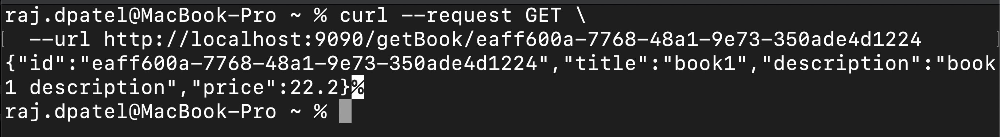
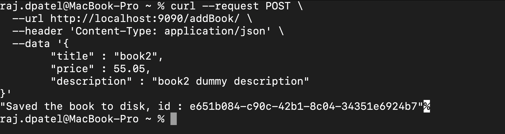

## HTTP Assignment

base url - `localhost:9090`

##### Endpoints :

> get existing book from disk
>
`GET` /getBook/:id  &nbsp;  *(id required)*

---
> create a new Book and save to disk
>
`POST` /addBook/  &nbsp;  *(title, description and price required in request body)*

